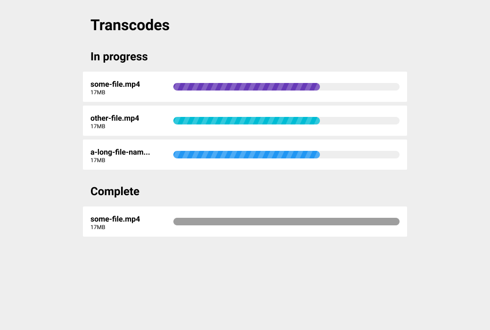

## The task

Display the progress of our transcodes in React. There are multiple transcodes running and each one progresses from 0% to 100%.

## Getting started

Start the create-react-app dev server

```bash
npm start
```

## Mockup 


The Pusher API docs are at:
http://pusher.com/docs/client_api_guide
